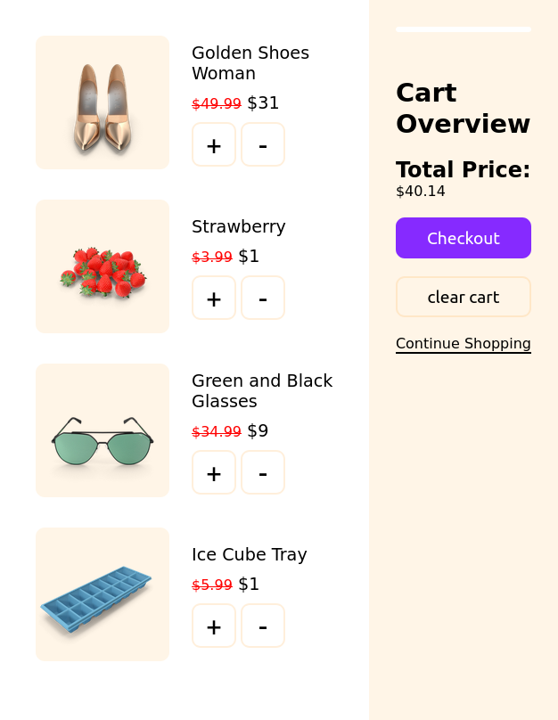
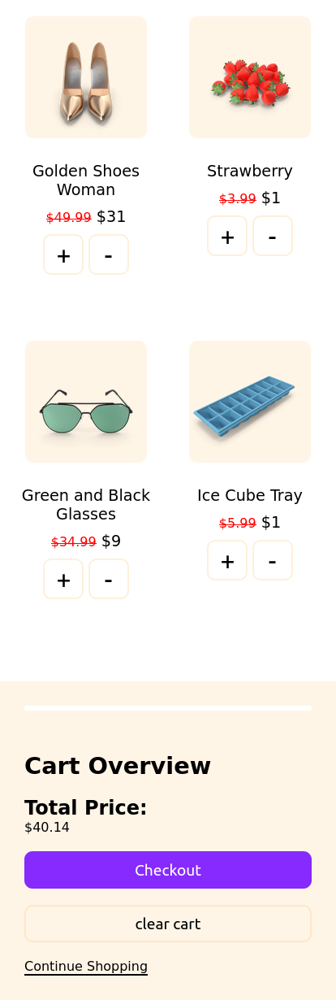

# Shopping Cart Interface

## Description

This is a simple shopping cart interface that displays items in the cart and the total price of the items in the cart.

## Screenshots

## Tech Stack

- HTML
- CSS
- JavaScript

## Setup

1. Clone the repository: `git clone https://github.com/NesryaAbdulkadir/ShopingCartInterface.git`.
2. open the index.html file in your browser.

## Author

👤 **Nesrya Abdulaziz**

- [Nesrya Abdulkadir](https://github.com/NesryaAbdulkadir)
